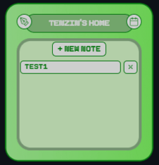
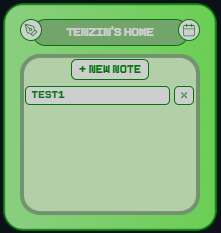
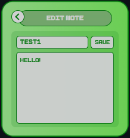
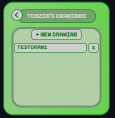
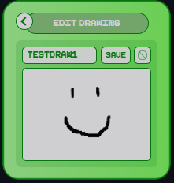
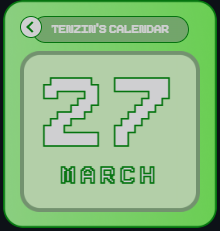

# Note Taking App



## Table of Contents

- [Description](#description)
- [Technologies](#technologies)
- [Features](#features)
- [Screenshots/Demo](#screenshotsdemo)
- [How To Use](#how-to-use)
- [Project Structure](#project-structure)
- [References](#references)

## Description

Note Taking App is a lightweight Electron desktop app for creating text notes, checking a calendar view, and making simple drawable attachments.

This project uses Electron with HTML, CSS, and vanilla JavaScript to keep the app fast, simple, and easy to understand while still supporting desktop file storage.

I followed this tutorial as a starting point: <https://www.youtube.com/watch?v=btxGSJ3Dh8E>

Figma design: <https://www.figma.com/design/wrgDeTSraG2D9PucyOAjkC/UI-Design?node-id=0-1&t=YdJG3D9eOvKyBFMy-1>

## Technologies

- Electron
- HTML5
- CSS3
- Vanilla JavaScript
- Node.js `fs` and `path` (for local file storage)

## Features

- Home view with note management
- Calendar view with icon-based navigation
- Notes system: create, open, edit, save, and delete notes
- Notes persisted as `.txt` files in Electron `userData/notes`
- Drawings system: create, open, edit, save, and delete drawings
- Drawing canvas with black pen and fixed brush size
- Clear canvas action
- Drawings persisted as `.png` files in Electron `userData/drawings`
- Frameless pixel-style UI with custom icons and themed panels

## Screenshots/Demo







## How To Use

### Installation

1. Clone the repository:

   ```bash
   git clone https://github.com/tenlean/note-taking-app.git
   ```

2. Go to the project folder:

   ```bash
   cd note-taking-app
   ```

3. Install dependencies:

   ```bash
   npm install
   ```

### Usage

1. Start the app:

   ```bash
   npm start
   ```

2. Use the Home view to manage notes.
3. Use the calendar icon to open Calendar.
4. Use the pen icon to open Drawings.
5. Save notes/drawings to persist data across restarts.

## Project Structure

```text
note-taking-app/
  assets/
      calendar-icon.png
      pen-icon.png
      clear-icon.png
      inner-frame-bg.png
      outer-frame-bg.png
      Pixeboy.ttf
      screenshots/
         project-image.gif
         home-view.png
         note-editor-view.png
         drawing-view.png
         drawing-editor-view.png
         calendar-view.png
  index.html
  main.js
  preload.js
  script.js
  styles.css
  package.json
  package-lock.json
  README.md
```

## References

- Tutorial used: <https://www.youtube.com/watch?v=btxGSJ3Dh8E>
- Figma design: <https://www.figma.com/design/wrgDeTSraG2D9PucyOAjkC/UI-Design?node-id=0-1&t=YdJG3D9eOvKyBFMy-1>
